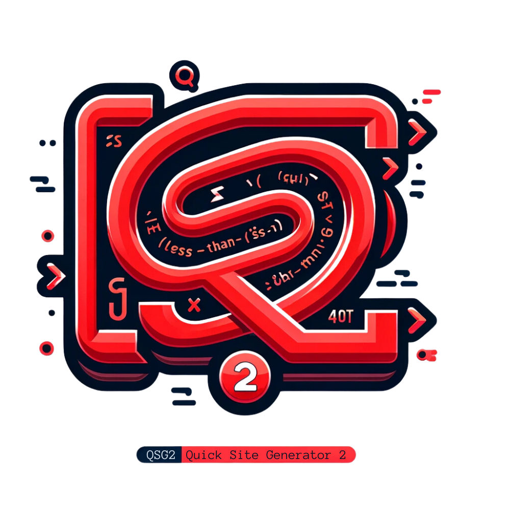

# Quick Site Generator 2


Quick Site Generator 2 is a static website generator inspired by Nikola and written using Zsh.

<br><br><br>
## Why?

Well, I wanted something that worked for me and wasn't too complicated and I also like a challenge.

## What is qsgen2?

```qsgen2``` is capable of creating static HTML pages using the native ```_html``` engine that uses ```QStags``` (that I'll describe in detail later) or by writing your pages and blogs in Markdown. It uses [Pandoc](https://github.com/jgm/pandoc/releases), mostly because it's the most compete tool for the job. Not all Linux distributions have it, so you can just download the binaries and place them where it suits you the best.

You cannot mix native and Markdown when creating your project.

## Configuration

Copy ```qsgen2``` and the directory ```include``` to ${HOME}/bin/.

Then create you project directory, for example ```${HOME}/sites/new-site```.
Copy the file ```config``` and the directory ```themes``` to your project directory.

You first have to configure your site and this is done in the file [config](config).
Do the necessary changes.

Create a directory named ```blog``` if you want to have blogs on your site.

Create your index file with either ```tpl``` to use the native engine or ```md``` to use Markdown.
I will, as mentioned, create a how-to on ```QStags```.

I am considering adding a command line, ```init```, that will guide you through this process in an interactive manner.

## Themes

```qsgen``` uses templates that reside in ```$project_dir/themes/<theme name>```. 
The theme consists of 4 files:

* blogs.tpl
* pages.tpl
* blog_index.tpl
* blog_list.tpl

### Blogs

The file ```blogs.tpl``` is used to create the blog posts that will reside in ```$www_root/blogs/year/mon/date/title-of-blog-post.html```.
```qsgen2``` will list all the files in ```blog/*.blog``` and do its magic before the word/tag ```BODY``` in the blogs.tpl file is replaced with the HTML formatted content and then the file will be written to disk.

Other tags/words that are replaced are:

* BLOGTITLE
* CALADAY
* CALNDAY
* CALMONTH
* CALYEAR
* INGRESS

Then the footer of the document is updated with today's date and the name and version of the script.

The themes engine is not 100% complete because there still are some static text that could or should be replaced. It is, however, quite easy.

#### Blog Index

There is an option in the file ```config``` if you want to show the blog on the front page or not. If set to false, it will write a file in ```$www_root/blog/index.html``` that contains, in reverse order, the blogs written.

To do this it uses the file ```blog_list.tpl``` as a template for how to format this list and then it inserts this into the file ```blog_index.tpl``` which then is written to disk.

### Pages

The process of creating pages is almost the same as with blogs, but with fewer, and other, replacements.

Tags replaced are:

* #pagetitle
* #tagline
* BODY

And then the footer gets the same touch as the blog posts.
